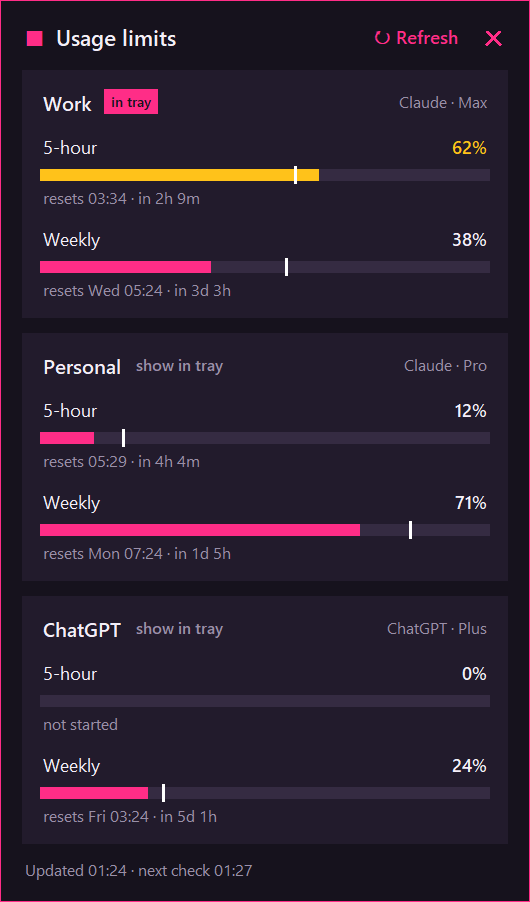
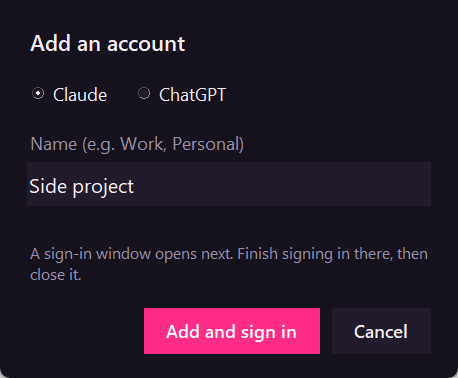
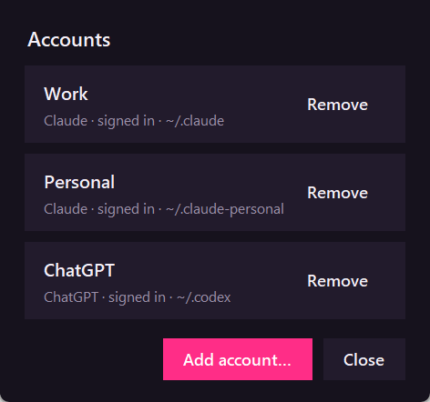

# Claude Usage Tracker

A small Windows tray icon that shows the 5-hour and weekly usage limits for any number of **Claude** and **ChatGPT** accounts. Each account signs in once and stays signed in, so switching between them never needs a new login.

- **Tray icon**: a hot-pink tile showing the 5-hour % on top, with 5-hour and weekly bars underneath. A bar turns amber when you're using the limit faster than time is passing.
- **Left-click**: opens a popup listing every account. Each has bars, reset times, a white "time elapsed" marker, and a **Refresh** button. The popup scrolls once there are more than 4 accounts.
- **Right-click**:
  - **Tray shows**: choose which account the icon shows.
  - **Refresh now**.
  - **Add account…**: choose Claude or ChatGPT, give it a name (e.g. Work, Personal), and a sign-in window opens.
  - **Manage accounts…**: see each account, sign in again, or **Remove** it.
  - **Start at login**, **Uninstall…**, **Quit**.
- Refreshes every 3 minutes, and every 15 minutes when the PC is idle. It also checks just after a limit resets.

One Python file ([tracker.pyw](tracker.pyw)), using `pystray` and `Pillow`.

## Screenshots

<p>
  
</p>

The tray icon shows the 5-hour % with 5-hour and weekly bars. A bar turns amber when you're using that limit faster than time is passing, and a grey `!` means the account needs signing in.


| Add account | Manage accounts |
|---|---|
|  |  |

*Screenshots use demo accounts and numbers.*

## Where the numbers come from

| Account | Source | Login it reads |
|---|---|---|
| Claude | `api.anthropic.com/api/oauth/usage` (the same unofficial endpoint Claude Code uses) | Claude Code's `.credentials.json` in the account's folder. The token is only ever sent in the request header, never logged or copied. |
| ChatGPT | The local `codex app-server` (`account/rateLimits/read`), which talks to OpenAI itself | None. Codex handles its own login, and this app never reads Codex credentials. |

ChatGPT here means the **Codex** usage limits that come with your ChatGPT plan. The message caps in the ChatGPT website and app aren't published anywhere a tool can read.

## Requirements

- Windows 10 or 11
- Python 3.11 or newer ([python.org](https://www.python.org/downloads/))
- Signed in to at least one of: [Claude Code](https://docs.anthropic.com/en/docs/claude-code) on a Claude Pro, Max, Team or Enterprise plan, or [Codex](https://github.com/openai/codex) signed in with ChatGPT

## Install

Download or clone this folder, keep it somewhere permanent (the shortcuts point at it), then run:

```powershell
powershell -ExecutionPolicy Bypass -File install.ps1
```

This installs `pystray` and `Pillow` if they're missing, writes `icon.ico` and `settings.json` into this folder, adds a Start Menu shortcut, a Startup shortcut and a **Claude Usage Tracker** shortcut in this folder, and starts the tracker. To start it by hand, double-click that shortcut. `tracker.pyw` itself only opens on double-click if `.pyw` files are set to open with `pythonw`.

Windows hides new tray icons at first. Click the `^` arrow next to the clock and drag the pink icon onto the taskbar.

## Accounts

Each account is its own CLI login folder:

- The first Claude account uses Claude Code's main folder (`~/.claude`). More Claude accounts get `~/.claude-<name>`.
- The first ChatGPT account uses Codex's main folder (`~/.codex`). More ChatGPT accounts get `~/.codex-<name>`.

**Add account** creates the folder and opens a sign-in window (`claude auth login` or `codex login`). The tracker refreshes when you close that window.

**Remove** signs the account out by deleting its `~/.claude-*` or `~/.codex-*` folder. For an account using the main `~/.claude` or `~/.codex` folder, Remove only takes it off the list, because Claude Code or Codex itself uses that folder.

Claude logins expire every few hours. When one is close to expiring, the tracker quietly runs Claude Code for that account (`claude auth status`, then `claude update` if needed) so the CLI renews it. The tracker never edits login files itself.

## Settings

`settings.json` in this folder is managed from the tray menu. It can also be edited by hand; quit and restart the tracker afterwards.

```json
{
  "accounts": [
    { "name": "Work", "kind": "claude", "dir": null },
    { "name": "Personal", "kind": "claude", "dir": "~/.claude-personal" },
    { "name": "ChatGPT", "kind": "chatgpt", "dir": null }
  ],
  "tray_account": "Work",
  "poll_seconds": 180,
  "idle_poll_seconds": 900
}
```

`dir: null` means the CLI's main folder. Errors go to `tracker.log` in this folder, and no token is ever written there.

## Uninstall

Right-click → **Uninstall…**, or run:

```powershell
powershell -ExecutionPolicy Bypass -File uninstall.ps1
```

This stops the tracker and removes both shortcuts. It then asks whether to delete each extra login folder (`~/.claude-*`, `~/.codex-*`) and this app folder. It never touches the main `~/.claude` or `~/.codex` logins, and it leaves the shared Python packages installed.

## Notes

- Both usage sources are unofficial and may change without notice.
- It only reads CLI logins. The Claude desktop app stores its sign-in separately.
- Inspired by [Usage Monitor for Claude](https://github.com/jens-duttke/usage-monitor-for-claude) and [Usage Monitor for Codex](https://github.com/hybrid2102/usage-monitor-for-codex). Not affiliated with Anthropic or OpenAI.

## License

[MIT](LICENSE)
